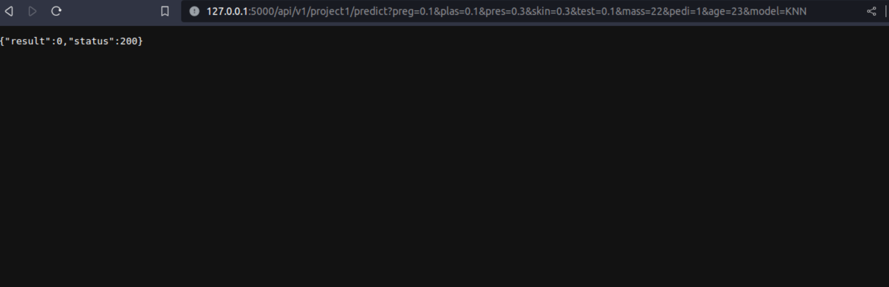
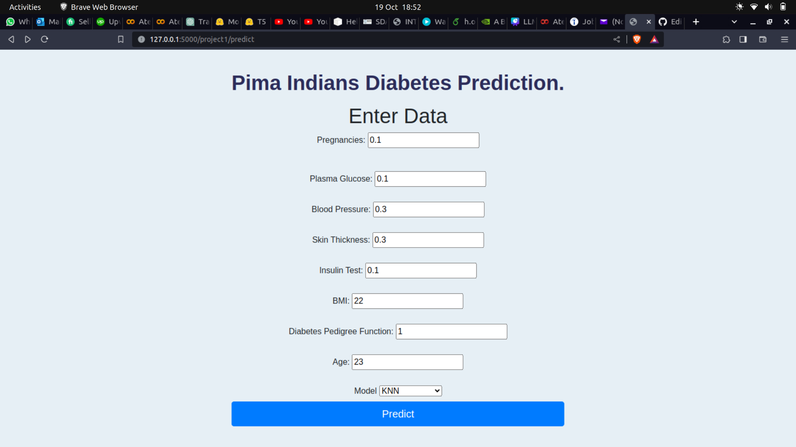

# The project 1 contains the same data set as flask project.

# Fast Api Application

## GetPrediction.py

this file contains the user input data and call the saved model and return the results whether its positive or negative.

## app.py

this file takes the user input and verify whether it match the required input or not using pydantic library.

## api example :

## interface example

the predict button will redirect the api link which return json file contain 0 or 1

# Hosting

For the hosting we will use the same step as flask project.
