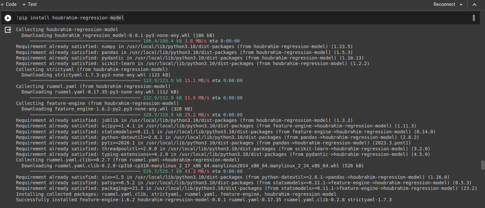
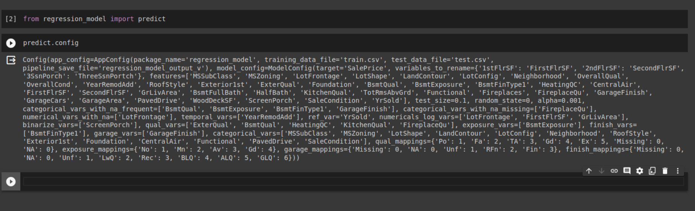

# upload 

- pip install twine
- python3 setup.py sdist bdist_wheel
- twine upload dist/*

# install package

now let's import predict function from our package.

# Output 

[**(PDF)**](images/notebook.pdf)
